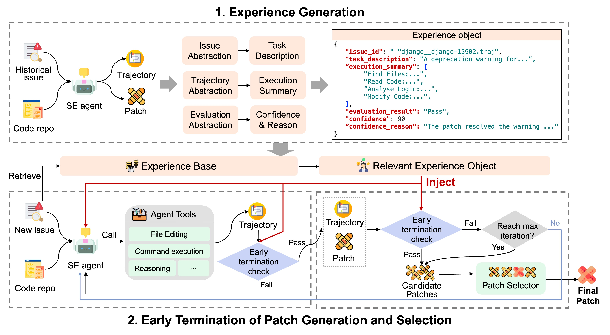

# EET: Experience-Driven Early Termination for Cost-Efficient Software Engineering Agents

[](LICENSE)

**EET** is a general experience-driven approach that reduces the cost of software engineering (SE) agents while preserving task performance. EET extracts structured experience from prior issue-resolution executions and leverages it to guide patch generation and selection, enabling early termination of unproductive iterations.

## 📋 Table of Contents

- [Overview](#overview)
- [Key Features](#key-features)
- [Architecture](#architecture)
- [Installation](#installation)
- [Quick Start](#quick-start)
- [Usage](#usage)
  - [Agentless](#agentless)
  - [Mini-SWE-Agent](#mini-swe-agent)
  - [Trae Agent](#trae-agent)
- [Experience Extraction](#experience-extraction)
- [Results](#results)
- [Citation](#citation)

## 🎯 Overview

Software engineering agents powered by large language models are increasingly adopted in practice, yet they often incur substantial monetary cost. EET addresses this challenge by:

1. **Extracting structured experience** from historical issue-resolution activities, encoding information about the issue, execution trajectory, and outcomes
2. **Retrieving relevant experience** when tackling new issues to guide agent behavior
3. **Enabling early termination** of redundant iterations during both patch generation and selection

EET consistently reduces total cost by **19%–55%** (32% on average) with negligible loss in resolution rate (at most 0.2%) across three representative SE agents on the SWE-bench Verified benchmark.

## ✨ Key Features

- **General Approach**: Seamlessly integrates into diverse agents without requiring fundamental redesigns
- **Cost Reduction**: Reduces API calls, input tokens, and output tokens by 21%, 30%, and 25% on average
- **Performance Preservation**: Maintains or improves resolution rates while reducing costs
- **Early Termination**: Identifies early-termination opportunities for 11% of issues on average
- **Multi-Agent Support**: Works with Agentless, Mini-SWE-Agent, and Trae Agent

## 🏗️ Architecture

EET operates through two complementary mechanisms:

### Experience Extraction

EET captures structured experience from historical issue-resolution activities, including:
- Issue description and metadata
- Agent execution trajectory
- Outcomes of prior attempts
- Confidence scores for different steps

### Experience-Guided Execution

When tackling a new issue, EET:
1. Retrieves relevant experience from the experience store
2. Uses confidence thresholds to guide early termination:
   - **Patch Generation**: Terminates if confidence exceeds `τ^gen` (default: 90)
   - **Patch Selection**: 
     - Assumes correctness if confidence exceeds `τ^sel_upper` (default: 90)
     - Considers issue too difficult if confidence below `τ^sel_lower` (default: 40)

### Methodology

For detailed methodology and technical details, please refer to the following document:

<p align="center">
  
</p>

## 📦 Installation

### Prerequisites

- Python 3.10+ (3.11+ for Agentless, 3.12+ for Trae Agent)
- API keys for your chosen LLM provider (OpenAI, Anthropic, etc.)

### Setup

Clone the repository:

```bash
git clone https://github.com/EffiSEAgent/EET.git
cd EET
```

Each agent has its own setup requirements. See the respective sections below for detailed installation instructions.

## 🚀 Quick Start

### 1. Extract Experiences from Historical Runs

First, extract experiences from your historical agent execution trajectories. We apply Swe-bench Lite as default settings. You should run the benchmark first and then generate the experiences, or use our default experiences.

**For Mini-SWE-Agent:**
```bash
cd mini-swe-agent
python -m minisweagent.experience.extract_with_llm_judge \
    /path/to/trajectory/directory \
    --model "openai/gpt-5-mini" \
    --output extracted_experiences.jsonl
```

**For Trae Agent:**
```bash
cd trae-agent
python -m trae_agent.experience.extract_with_llm_judge \
    /path/to/trajectory/directory \
    --model "openai/gpt-5-mini" \
    --output extracted_experiences.jsonl
```

**For Agentless:**
```bash
cd Agentless
python experience/extract_exp/extract_from_verified.py \
    --results_dir /path/to/results \
    --extracted_ids_file /path/to/extracted_ids.txt \
    --output_dir experience/extracted_experiences
```

This will generate experience files for different stages:
- `experiences_file_level.jsonl`
- `experiences_related_elements.jsonl`
- `experiences_edit_location_individual.jsonl`
- `experiences_repair_sample_1.jsonl`

### 2. Run Agent with EET

Configure the agent to use the experience store and run on new issues:

**Mini-SWE-Agent:**
```bash
mini-extra swebench \
    --config config/swebench_experience.yaml \
    --experience-store-path extracted_experiences.jsonl
```

**Trae Agent:**
```bash
trae-cli run "Fix the bug in main.py" \
    --instance-id django__django-16910 \
    --experience-store-path extracted_experiences.jsonl
```

**Agentless:**
Place the extracted experience files in `Agentless/experience/extracted_experiences/`:
- `experiences_file_level.jsonl` for file-level localization
- `experiences_related_elements.jsonl` for related elements localization
- `experiences_edit_location_individual.jsonl` for edit location localization
- `experiences_repair_sample_1.jsonl` for repair

Then run as usual - EET will automatically load experiences if the files exist.

## 📖 Usage

### Agentless

Agentless follows a three-phase process: localization, repair, and patch validation.

#### Setup

```bash
cd Agentless
conda create -n agentless python=3.11
conda activate agentless
pip install -r requirements.txt
export PYTHONPATH=$PYTHONPATH:$(pwd)
export OPENAI_API_KEY=your_api_key
```

#### Running with EET

1. **Localization** (find edit locations):
```bash
# File-level localization
python agentless/fl/localize.py --file_level \
    --output_folder results/file_level \
    --num_threads 10

# Related elements localization
python agentless/fl/localize.py --related_level \
    --output_folder results/related_elements \
    --start_file results/file_level/loc_outputs.jsonl \
    --num_threads 10

# Edit location localization
python agentless/fl/localize.py --fine_grain_line_level \
    --output_folder results/edit_locations \
    --start_file results/related_elements/loc_outputs.jsonl \
    --num_threads 10
```

2. **Repair** (generate patches with EET):
```bash
# Place experiences_repair_sample_1.jsonl in Agentless/experience/extracted_experiences/
python agentless/repair/repair.py \
    --loc_file results/edit_locations/loc_outputs.jsonl \
    --output_folder results/repair \
    --max_samples 10 \
    --num_threads 2
```

EET will automatically load experiences from `Agentless/experience/extracted_experiences/experiences_repair_sample_1.jsonl` if it exists.

3. **Patch Validation** (select best patch):
```bash
# Run regression tests
python agentless/test/run_regression_tests.py \
    --regression_tests results/regression_tests.jsonl \
    --predictions_path results/repair/output_0_processed.jsonl \
    --run_id repair_regression

# Rerank patches
python agentless/repair/rerank.py \
    --patch_folder results/repair/ \
    --num_samples 10 \
    --regression \
    --reproduction
```

For detailed instructions, see [Agentless/README_swebench.md](Agentless/README_swebench.md).

### Mini-SWE-Agent

Mini-SWE-Agent is a minimal agent that uses bash for code navigation and editing.

#### Setup

```bash
cd mini-swe-agent
pip install -e .
export OPENAI_API_KEY=your_api_key  # or ANTHROPIC_API_KEY
```

#### Running with EET

1. **Extract Experiences**:
```bash
python -m minisweagent.experience.extract_with_llm_judge \
    /path/to/trajectory/directory \
    --model "openai/gpt-5-mini" \
    --output extracted_experiences.jsonl \
    --pattern "*_cleaned.json"
```

2. **Run on SWE-bench**:
```bash
mini-extra swebench \
    --config src/minisweagent/config/extra/swebench_experience.yaml \
    --model "openai/gpt-5-mini"
```

The config file should specify the experience store path in the `agent` section:
```yaml
agent:
  experience_store_path: "extracted_experiences.jsonl"
  experience_top_k: 1
  experience_min_similarity: 0.1
  experience_use_tfidf: true
  experience_search_by_issue: true
```

3. **Run on Single Issue**:
```bash
mini -t "Fix the bug in QuerySet.only()" \
    --config config_with_experience.yaml
```

Create `config_with_experience.yaml`:
```yaml
agent:
  experience_store_path: "extracted_experiences.jsonl"
  experience_top_k: 1
  experience_min_similarity: 0.1
  experience_use_tfidf: true
  experience_search_by_issue: true
```

For detailed instructions, see [mini-swe-agent/README.md](mini-swe-agent/README.md).

### Trae Agent

Trae Agent performs both patch generation and selection with parallel execution.

#### Setup

```bash
cd trae-agent
uv sync --all-extras
source .venv/bin/activate
```

Configure `trae_config.yaml`:
```yaml
agents:
  trae_agent:
    enable_lakeview: true
    model: trae_agent_model
    max_steps: 200
    tools:
      - bash
      - str_replace_based_edit_tool
      - sequentialthinking
      - task_done

models:
  trae_agent_model:
    model_provider: openai
    model: gpt-5-mini
    max_tokens: 4096
    temperature: 0.5
```

#### Running with EET

1. **Extract Experiences**:
```bash
python -m trae_agent.experience.extract_with_llm_judge \
    /path/to/trajectory/directory \
    --model "openai/gpt-5-mini" \
    --output extracted_experiences.jsonl
```

2. **Run on Single Issue**:
```bash
# Option 1: Use default path (trae_agent/prompt/extracted_experiences_summarized_merged.jsonl)
trae-cli run "Fix the bug in QuerySet.only()" \
    --instance-id django__django-16910 \
    --provider openai \
    --model gpt-5-mini

# Option 2: Specify custom experience store path via config file
# Edit trae_config.yaml to set experience_store_path in agent config
trae-cli run "Fix the bug in QuerySet.only()" \
    --instance-id django__django-16910 \
    --provider openai \
    --model gpt-5-mini
```

Note: Trae Agent loads experiences from the default path `trae_agent/prompt/extracted_experiences_summarized_merged.jsonl` if no custom path is specified. To use a custom path, modify the agent initialization code or use a wrapper script.

3. **Run Evaluation**:
```bash
cd evaluation
python run_evaluation.py \
    --config config_with_experience.yaml
```

For detailed instructions, see [trae-agent/README.md](trae-agent/README.md).

## 🔍 Experience Extraction

EET extracts structured experience from agent execution trajectories. The experience format includes:

```json
{
  "issue_id": "django_django-16910.traj",
  "task_description": "Issue description...",
  "execution_summary": [
    "Find Files: Locate QuerySet.only() implementation",
    "Read Code: Inspect QuerySet.only() method",
    "Modify Code: Apply patch to fix the issue"
  ],
  "evaluation_result": "Pass",
  "confidence": 90,
  "confidence_reason": "High confidence due to...",
  "created_at": "2025-11-09T23:55:25.286001",
  "metadata": {
    "original_count": 8,
    "summarization_method": "llm",
    "model": "openai/gpt-5-mini"
  }
}
```

### Extraction Methods

1. **Rule-based Extraction**: Fast extraction from trajectory files (Mini-SWE-Agent)
2. **LLM-based Extraction**: More accurate extraction using LLM as judge (all agents)

### Configuration

Key thresholds for early termination:

- **`τ^gen`** (Patch Generation): Default 90
  - Terminates patch generation if confidence exceeds this threshold
- **`τ^sel_upper`** (Patch Selection Upper): Default 90
  - Assumes patch is correct if confidence exceeds this threshold
- **`τ^sel_lower`** (Patch Selection Lower): Default 40
  - Considers issue too difficult if confidence below this threshold

## 📖 Prompt

We put all the relative prompt of our project in the Prompt folder. You can use this set of prompts on any software agent you like to modify!

## 📊 Results

EET was evaluated on SWE-bench Verified across three agents with different LLM backends:

| Agent | Backend | Cost Reduction | Resolution Rate Change |
|-------|---------|----------------|------------------------|
| Agentless | GPT-5-mini | -55.1% | +7.8% |
| Agentless | DeepSeek-V3.2 | -31.8% | +7.2% |
| Mini-SWE-Agent | GPT-5-mini | -19.4% | +1.0% |
| Mini-SWE-Agent | DeepSeek-V3.2 | -19.3% | +0.6% |
| Trae Agent | GPT-5-mini | -28.2% | 0.0% |
| Trae Agent | DeepSeek-V3.2 | -36.7% | -0.2% |
| **Average** | | **-31.8%** | **+2.7%** |

### Efficiency Gains

- **Early Termination**: Identifies opportunities for 8.6%–14.0% of issues (11.3% on average)
- **Token Reduction**: 
  - Input tokens: -29.9% on average
  - Output tokens: -25.1% on average
- **API Calls**: -20.8% on average

## 📄 License

This project is licensed under the MIT License - see the [LICENSE](LICENSE) file for details.

## 🙏 Acknowledgments

- [Agentless](https://github.com/OpenAutoCoder/Agentless) - The agentless approach for SE tasks
- [Mini-SWE-Agent](https://github.com/SWE-agent/mini-swe-agent) - The minimal SWE agent
- [Trae Agent](https://github.com/bytedance/trae-agent) - The LLM-based agent for SE tasks
- [SWE-bench](https://www.swebench.com/) - The benchmark for evaluating SE agents

## 📚 Additional Resources

- [Methodology](readme_src/Methodology.jpg)
- [Agentless Documentation](Agentless/README.md)
- [Mini-SWE-Agent Documentation](mini-swe-agent/README.md)
- [Trae Agent Documentation](trae-agent/README.md)

